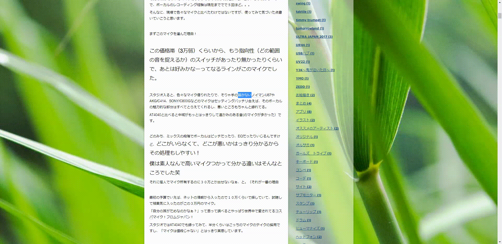

# TakobotoQuickSearch
Just a little handy dandy extension I whipped up to allow me to quickly search selected text in Takoboto, a Japanese Dictionary Site

## How to Install
You can install this directly into Chrome if you enable Developer Mode and load this extension as Unpacked

## How to Use
- Open a Site
- Select text
- Right click to open Context Menu
- Select the Takoboto option

